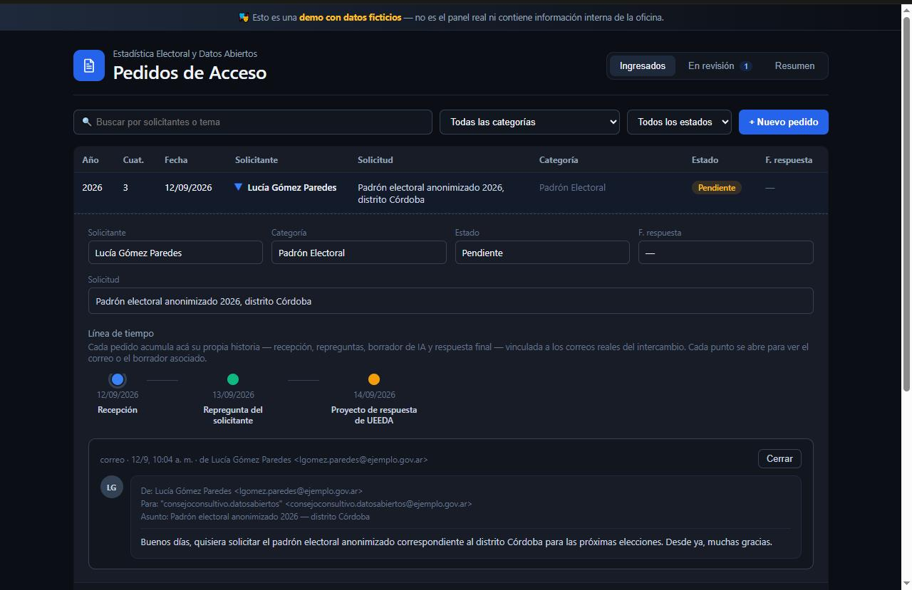
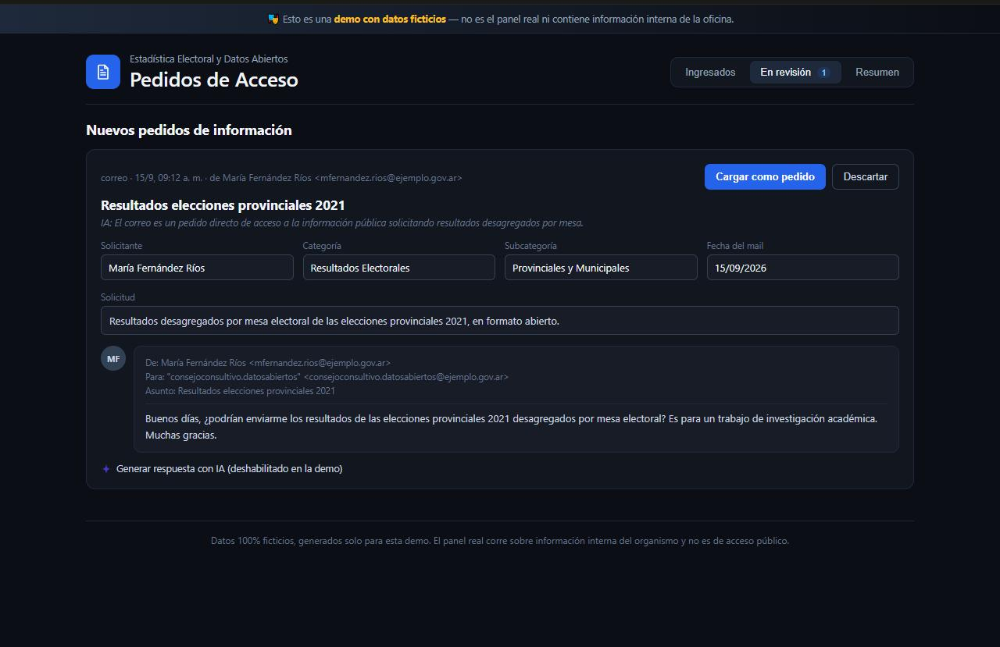
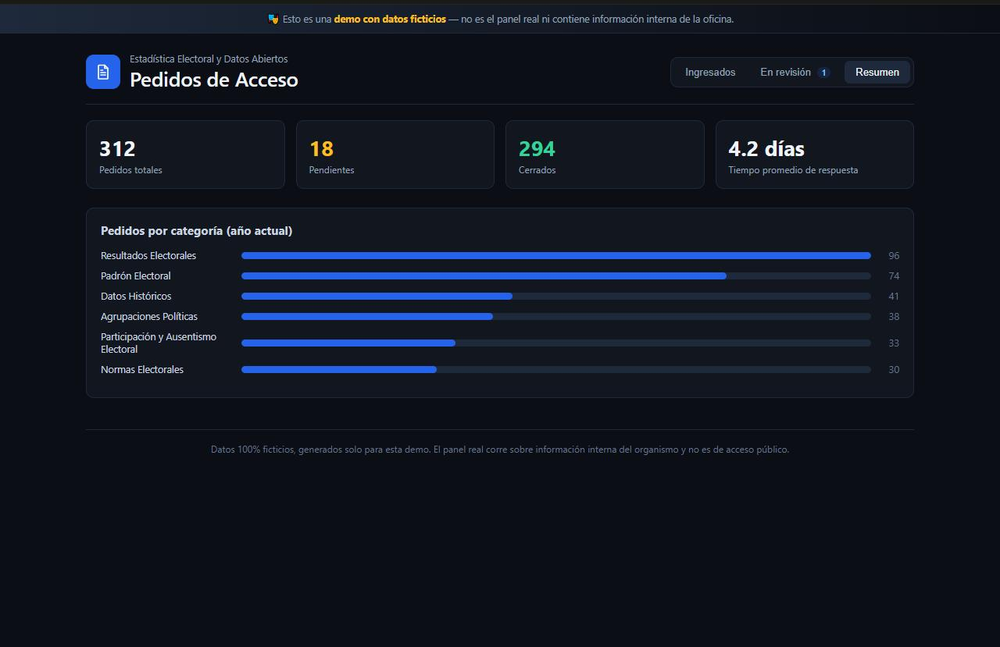

# Mail_Bot

**Pipeline de ingesta, clasificación y gestión de pedidos de acceso a la información pública — con inteligencia artificial y un humano validando cada paso.**

Todos los días llegan al correo institucional pedidos de acceso a la
información pública: personas que preguntan por datos electorales,
estadísticas, resultados históricos, padrones, y muchos temas más. Leer
cada correo, decidir de qué se trata y anotarlo a mano lleva tiempo — y
es fácil que algo se traspapele.

UEEDA_Bot automatiza esa lectura de punta a punta — ingesta, clasificación
y persistencia — sin sacarle a una persona la última palabra sobre qué se
carga, se cierra o se responde.

## El pipeline

```
IMAP  ──▶  Clasificación (Gemini)  ──▶  Cola de revisión (Next.js)  ──▶  Supabase (Postgres)
 │                                              │                              │
 └── Programador de tareas, cada 1h             └── validación humana         ├──▶ Google Sheets (sync idempotente)
                                                                               └──▶ Web Push (aviso en tiempo real)
```

1. **Ingesta (IMAP)** — un worker en Python se conecta por IMAP al correo
   institucional cada 1 hora, trae los mensajes nuevos y descarta lo que
   ya se procesó (dedupe por `email_uid`, sin marcar nada como leído en
   el servidor).
2. **Clasificación (Gemini)** — cada correo nuevo pasa por un modelo de
   Gemini con un prompt de clasificación versionado: ¿es un pedido de
   acceso nuevo, una respuesta a uno existente, o no tiene relación? El
   modelo también propone solicitante, categoría y fecha. Reglas de
   negocio editables (`contexto_clasificacion.md`) filtran spam/listas
   internas *antes* de gastar una llamada a la IA.
3. **Human-in-the-loop (panel de revisión)** — nada de esto se carga
   solo. Cada propuesta cae en una cola de revisión donde una persona
   confirma, corrige o descarta. La IA nunca escribe en la base de
   datos por su cuenta.
4. **Persistencia (Supabase/Postgres)** — una vez confirmado, el pedido
   queda en Postgres con RLS (lectura pública, escritura autenticada) y
   una línea de tiempo completa: recepción, cada respuesta, cada
   repregunta, hasta el cierre.
5. **Distribución** — cada alta o cambio se sincroniza en tiempo real y
   de forma idempotente a Google Sheets (vía webhook + upsert, sin
   duplicar filas ni perder cierres), y dispara un aviso push a quien
   tenga la app instalada.

Todo el ciclo corre desatendido, orquestado por el Programador de tareas
de Windows — la única pieza que necesita estar dentro de la red interna
del organismo, ya que el resto (panel, base de datos, IA) vive en la
nube pública.

## Por qué human-in-the-loop, no automatización ciega

La IA propone; nunca decide. Esa frontera está en el diseño, no es una
promesa: el bot nunca inserta un pedido, nunca cierra uno, nunca manda
una respuesta. Todo lo que hace es dejar una propuesta lista — con la
clasificación, los campos completados y hasta un borrador de respuesta —
para que una persona la revise con un vistazo y decida. Eso permite
capturar la velocidad de la automatización sin resignar el criterio (ni
la responsabilidad) humano en un trámite público.

## Demo interactiva

El panel real corre sobre datos internos de la oficina, así que no hay
un link público para mostrar. En cambio, [`docs/demo.html`](docs/demo.html)
es un mockup interactivo con datos 100% ficticios que reproduce la
misma interfaz (tabla con filtros, cola de revisión, resumen) — se
puede abrir directo desde el navegador, o activando GitHub Pages sobre
`/docs` en este repo para tener un link.

## Capturas

*(capturas del [mockup de la demo](docs/demo.html) — el panel real corre sobre datos internos, así que no se muestra directamente)*

**Panel principal, con la línea de tiempo interna de un pedido desplegada**


**Cola de revisión — un correo entrante recién clasificado por la IA**


**Resumen de gestión**


## Los beneficios

| Beneficio | Qué significa en la práctica |
|---|---|
| Nada se pierde | Ningún correo con un pedido queda sin detectar: el bot revisa la casilla todo el tiempo, incluso fuera de horario. |
| Se ahorra tiempo | La tarea mecánica de leer y clasificar correo ya viene hecha; el equipo solo confirma. Confirmar lleva segundos, leer todo el correo a mano llevaba horas. |
| Todo queda trazable | Cada pedido tiene su historia completa registrada: cuándo llegó, quién respondió, cuándo y cómo se cerró. Se puede reconstruir cualquier caso en segundos. |
| Ayuda a responder | El sistema genera un modelo de respuesta con inteligencia artificial como punto de partida, que el equipo revisa y ajusta antes de enviarlo. |
| Da una foto clara de la gestión | Un panel de resumen muestra cuántos pedidos hay, cuántos están cerrados, cuántos pendientes, y por qué tema — con un Excel descargable listo para reportar. |
| Siempre decide una persona | La inteligencia artificial propone y ordena; nunca carga, cierra ni responde nada por su cuenta. El control humano está garantizado en cada paso. |

## Stack

- **Ingesta**: Python + IMAP (`imaplib`), con manejo de reintentos y estado de sincronización persistido.
- **Clasificación / generación**: Gemini (Google AI), prompts versionados y reglas de negocio editables sin redeploy.
- **Panel**: Next.js 16 (React) + Tailwind CSS, desplegado en Vercel.
- **Base de datos**: Supabase (PostgreSQL) — Row Level Security, triggers, webhooks.
- **Orquestación**: Programador de tareas de Windows (el bot corre en una máquina dentro de la red institucional; el resto del stack, en la nube pública).
- **Distribución**: sync idempotente a Google Sheets (OAuth, sin service account) + Web Push nativo.

## En síntesis

UEEDA_Bot no reemplaza al equipo: colabora con la parte más repetitiva
del trabajo para que el equipo se concentre en lo que realmente importa
— responder bien y a tiempo. El resultado es un pipeline de acceso a la
información más rápido, más prolijo y completamente trazable, sin
perder en ningún momento el criterio humano en las decisiones.

## Puesta en marcha

Para correr esto necesitás: un proyecto de Supabase, una cuenta de
Google Cloud (Sheets API + Gemini), un deploy en Vercel, y una máquina
dentro de la red institucional para el bot de correo.

```bash
npm install
cp .env.example .env.local   # completar con los valores reales
npm run dev
```

La guía paso a paso completa — credenciales, webhooks, Programador de
tareas, Web Push — está en [`docs/SETUP.md`](docs/SETUP.md).
